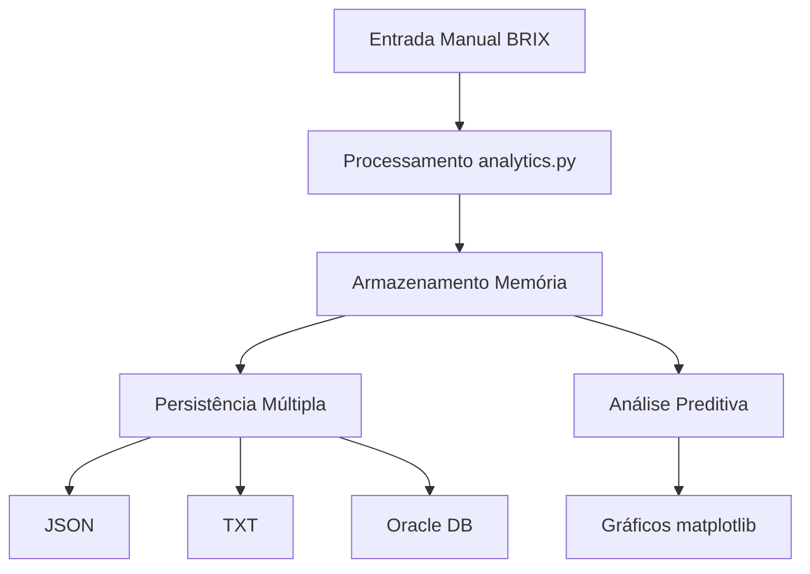

# FIAP - Faculdade de Informática e Administração Paulista

<p align="center">
<a href= "https://www.fiap.com.br/"></a>
</p>

<p align="center">


</p>

<br>

# Sistema de Análise BRIX para Cana-de-Açúcar 🌱

## Agentes IA Fiap

## 👨‍🎓 Integrantes: 
- <a href="https://www.linkedin.com/in/daniel-baião-0b351049/">Daniel Emilio Baião</a>
- Erik Criscuolo
- Marcus Vinícius Loureiro Garcia
- Sidney William de Paula Dias
- Hugo Rodrigues Carvalho Silva

## 👩‍🏫 Professores:
### Tutor(a) 
- <a href="https://www.linkedin.com/in/sabrina-otoni-22525519b/">Sabrina Otoni</a>
### Coordenador(a)
- <a href="https://www.linkedin.com/company/inova-fusca">André Godoi Chiovato</a>


## 📜 Descrição

O **Sistema de Análise BRIX para Cana-de-Açúcar** é uma solução especializada desenvolvida para determinar o momento ideal de colheita da cana-de-açúcar através da análise do **BRIX** (concentração de açúcar) e **Índice de Maturação**.

### 🎯 Objetivo Principal
Auxiliar produtores de cana-de-açúcar na tomada de decisão sobre o momento ideal de colheita, maximizando o rendimento industrial através da análise científica dos níveis de BRIX e maturação da cana.

### 🔬 Fundamentos Técnicos
- **BRIX**: Medida da concentração de sólidos solúveis (principalmente açúcar) no caldo da cana
- **Índice de Maturação (IM)**: Relação entre BRIX da ponta e base da cana
- **Critério Ideal**: BRIX ≥ 18° e IM entre 0,95-1,05
- **Metodologia**: Análise de três pontos (base, meio, ponta) para cálculo da maturação uniforme

## ⚡ Funcionalidades

### 📊 Análise de Dados
- **Cálculo Automático de BRIX Médio**: Processa valores de base, meio e ponta da cana
- **Cálculo do Índice de Maturação**: IM = BRIX_ponta / BRIX_base
- **Validação de Critérios**: Verificação automática dos parâmetros ideais de colheita

### 🔮 Previsão Inteligente  
- **Algoritmo de Regressão Linear**: Previsão do momento ideal de colheita
- **Projeção de 365 dias**: Visualização da evolução esperada da maturação
- **Alertas de Maturação**: Notificação quando atingir critérios ideais

### 💾 Gerenciamento de Dados
- **Múltiplos Formatos**: Suporte a JSON, TXT e banco Oracle
- **CRUD Completo**: Criar, ler, atualizar e deletar registros
- **Backup Automático**: Sincronização entre memória, arquivos e banco

### 📈 Visualização
- **Gráficos Evolutivos**: Acompanhamento da maturação ao longo do tempo
- **Projeções Futuras**: Visualização das tendências de BRIX e IM
- **Interface Intuitiva**: Menu interativo para operações

## 🛠️ Tecnologias Utilizadas

| Categoria | Tecnologia | Versão | Propósito |
|-----------|------------|--------|-----------|
| **Linguagem** | Python | 3.8+ | Desenvolvimento principal |
| **Visualização** | Matplotlib | 3.10.7 | Gráficos e análises visuais |
| **Dados Científicos** | NumPy | 2.3.3 | Cálculos matemáticos e regressão |
| **Banco de Dados** | Oracle Database | 21c+ | Persistência de dados |
| **Driver Oracle** | oracledb | 3.4.0 | Conexão com Oracle |
| **Formatos** | JSON nativo | - | Serialização de dados |

## 📋 Pré-requisitos

### Software Necessário
- **Python**: Versão 3.8 ou superior
- **Oracle Database**: 21c ou superior (ou acesso remoto)
- **Oracle Instant Client**: Para conexão local
- **Git**: Para clone do repositório

### Conhecimentos Recomendados
- Conceitos básicos de Python
- Fundamentos de banco de dados
- Noções de agronegócio (opcional)

## 🎮 Demonstração do Sistema

### Menu Principal
```
==============================
SISTEMA AGRÍCOLA INTEGRADO
==============================
1. Adicionar Novo Resultado do Dia
2. Exibir Resultados  
3. Remover Resultado
4. Salvar Resultados
5. Carregar Dados
6. Prever Momento Ideal de Colheita
7. Gerar Gráfico de Evolução
0. Sair
==============================
```

## 📖 Exemplos de Uso

### Caso 1: Análise de Cana Madura
```
Brix Base: 18.5
Brix Meio: 19.2  
Brix Ponta: 18.8

Resultado:
✅ Brix Médio: 18.83° (Ideal: ≥18°)
✅ Índice Maturação: 1.02 (Ideal: 0.95-1.05) 
🟢 RECOMENDAÇÃO: COLHEITA IDEAL!
```

### Caso 2: Cana Imatura  
```
Brix Base: 15.2
Brix Meio: 14.8
Brix Ponta: 14.5

Resultado:
❌ Brix Médio: 14.83° (Abaixo do ideal)
❌ Índice Maturação: 0.95 (Limite inferior)
🟡 AGUARDAR: Previsão de maturação em 15 dias
```

### Caso 3: Visualização Gráfica
O sistema gera automaticamente:
- Gráfico de evolução histórica do BRIX
- Projeção futura da maturação  
- Linhas de referência para valores ideais
- Indicação visual do momento ideal de colheita

## � Instalação e Execução

### 1️⃣ Clone do Repositório
```bash
git clone https://github.com/agentesiafiap/cursotiaos-fase2-grupo6-python.git
cd cursotiaos-fase2-grupo6-python
```

### 2️⃣ Configuração do Ambiente Python
```bash
# Criar ambiente virtual (recomendado)
python -m venv venv

# Ativar ambiente virtual
# Windows:
venv\Scripts\activate
# Linux/macOS:
source venv/bin/activate

# Instalar dependências
pip install -r config/requirements.txt
```

### 3️⃣ Configuração do Oracle Database

#### Opção A: Banco Local
```bash
# Instalar Oracle Database 21c
# Configurar usuário e senha conforme database_oracle.py
```

#### Opção B: Banco Remoto (FIAP)
```python
# Editar src/database_oracle.py com suas credenciais:
USER = "seu_rm"
PASSWORD = "sua_senha"  
DSN = "oracle.fiap.com.br:1521/ORCL"
```

### 4️⃣ Execução do Sistema
```bash
# Navegar para pasta src
cd src

# Executar aplicação
python main.py
```

### 5️⃣ Primeiro Uso
1. O sistema criará automaticamente as tabelas necessárias
2. Use a opção "1" para adicionar dados de BRIX
3. Teste as funcionalidades de previsão e gráficos

## 🏗️ Arquitetura do Sistema

### Módulos Principais
```
src/
├── main.py              # Interface principal e menu
├── analytics.py         # Cálculos de BRIX e algoritmos de previsão
├── database_oracle.py   # Conexão e operações do Oracle
├── file_manager.py      # Manipulação de arquivos JSON/TXT
└── utils.py            # Funções auxiliares e utilitários
```

### Fluxo de Dados


## 🐛 Resolução de Problemas

### Erro de Conexão Oracle
```bash
# Verificar credenciais em database_oracle.py
# Confirmar conectividade de rede
ping oracle.fiap.com.br
```

### Dependências não Instaladas
```bash
# Reinstalar requirements
pip install -r config/requirements.txt --force-reinstall
```

### Erro no Matplotlib
```bash
# Linux: instalar tkinter
sudo apt-get install python3-tk

# macOS: verificar instalação Python completa
brew install python-tk
```

## 📚 Documentação Adicional

- 📄 **[Documentação Técnica Completa](document/ai_project_document_fiap.md)**
- 🔧 **[Configuração Avançada](config/readme.md)**
- 📊 **[Guia de Análise BRIX](src/readme.md)**

## 🔬 Conceitos Agronômicos

### Entendendo o BRIX
- **Definição**: Percentual de sólidos solúveis totais
- **Unidade**: Graus Brix (°Bx)
- **Importância**: Determina qualidade e rentabilidade
- **Medição**: Refratômetro ou densímetro

### Processo de Maturação
1. **Vegetativo** (0-8 meses): Crescimento, baixo BRIX
2. **Transição** (8-10 meses): Início acúmulo açúcar
3. **Maturação** (10-12 meses): BRIX ideal atingido
4. **Declínio** (12+ meses): Possível deterioração


## 📋 Licença

<p xmlns:cc="http://creativecommons.org/ns#" xmlns:dct="http://purl.org/dc/terms/"><a property="dct:title" rel="cc:attributionURL" href="https://github.com/agodoi/template">MODELO GIT FIAP</a> por <a rel="cc:attributionURL dct:creator" property="cc:attributionName" href="https://fiap.com.br">Fiap</a> está licenciado sobre <a href="http://creativecommons.org/licenses/by/4.0/?ref=chooser-v1" target="_blank" rel="license noopener noreferrer" style="display:inline-block;">Attribution 4.0 International</a>.</p>


